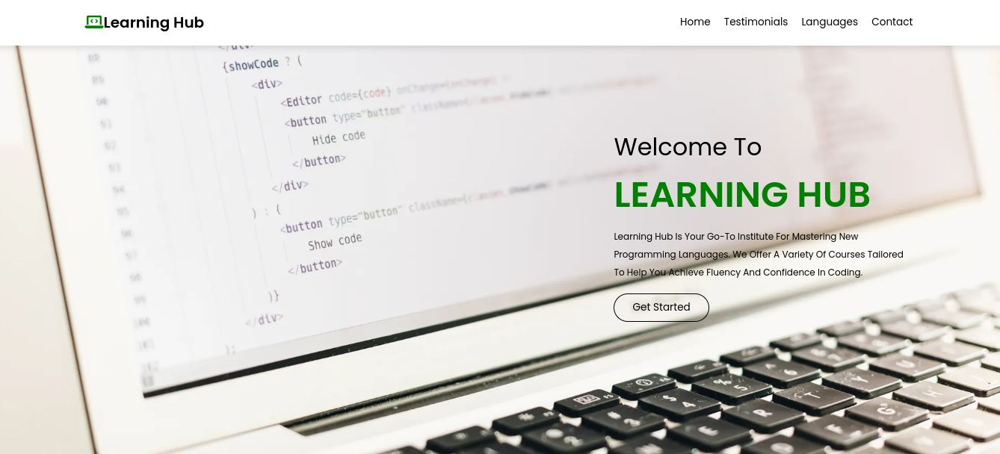

# Learning Hub

Learning Hub is a modern and stylish educational platform designed to showcase courses, student testimonials, and information about languages taught at the institute.

## Features

- Responsive design suitable for all devices.
- Interactive navigation with smooth scrolling.
- Testimonial section showcasing feedback from previous students.
- Detailed information about languages taught.
- Contact form for inquiries and feedback.

## Demo

You can see a live demo of the project [here](https://shivamds15.github.io/Learning-Hub-Web/).

## Installation

To run this project locally, follow these steps:

1. Clone the repository

2. Navigate into the project directory

3. Open `index.html` in your web browser.

## Usage

- Navigate through different sections using the navigation bar.
- Explore course details under the "Languages" section.
- Read testimonials from previous students in the "Testimonials" section.
- Contact the institute using the provided contact form.

## Contributing

Contributions are welcome! If you'd like to contribute to this project, follow these steps:

1. Fork the project.
2. Create your feature branch:
3. Commit your changes:
4. Push to the branch:
5. Submit a pull request.

## License

This project is licensed under the MIT License. See the [LICENSE](LICENSE) file for details.
